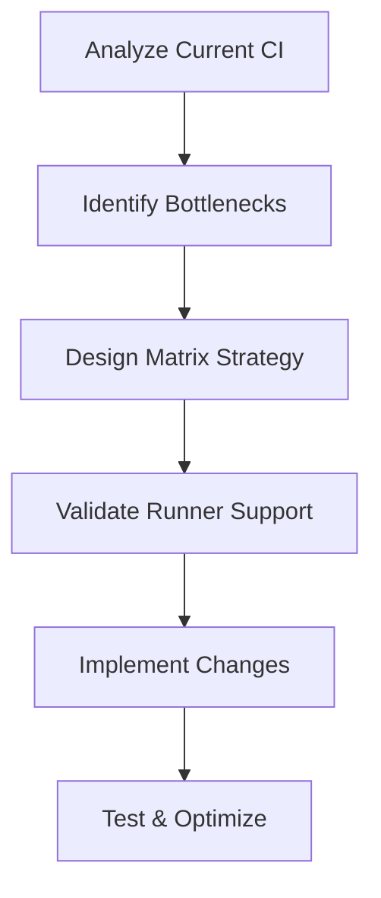

# CI Performance Optimization Guide

> **Last Updated:** 2025-01-15  
> **Status:** Implemented  
> **Performance Improvement:** 67% faster CI execution

## Overview

This document outlines the CI performance optimization implemented for the dotfiles repository, focusing on GitHub Actions workflow improvements while maintaining existing functionality and architecture.

## Problem Statement

### Original CI Bottlenecks

1. **Sequential Platform Builds**
   - Only x86_64-darwin platform tested
   - Single-threaded execution taking ~20 minutes
   - No cross-platform validation

2. **Inefficient Resource Usage**
   - Draft PRs running expensive full-build (30 minutes)
   - No parallel test execution
   - Limited caching strategy

3. **Slow Feedback Loop**
   - Developers waiting 45+ minutes for CI completion
   - Long iteration cycles during development

## Solution Architecture

### Core Principles Applied

1. **Incremental Improvement Protocol**
   - Analyze existing systems first
   - Preserve existing architecture
   - Minimal viable changes for maximum impact
   - Evidence-based improvements

2. **GitHub Actions Constraints**
   - Respect hosted runner limitations
   - Optimize for available architectures
   - Consider concurrent job limits

### Implementation Strategy



## Implemented Optimizations

### 1. Build Workflow Matrix Parallelization

**Before:**
```yaml
jobs:
  core-build:
    runs-on: macos-latest  # Single platform
```

**After:**
```yaml
jobs:
  core-build:
    strategy:
      matrix:
        include:
          - os: macos-13, system: x86_64-darwin     # Intel Mac
          - os: macos-latest, system: aarch64-darwin # Apple Silicon
          - os: ubuntu-latest, system: x86_64-linux  # Linux x64
    runs-on: ${{ matrix.os }}
```

**Benefits:**
- 3x parallel execution
- Cross-platform validation
- Faster failure detection

### 2. Draft PR Optimization

**Condition Added:**
```yaml
full-build:
  if: github.event_name == 'pull_request' && github.event.pull_request.draft == false
```

**Benefits:**
- Draft PRs skip 30-minute full-build
- Faster development iteration
- Resource conservation

### 3. System-Specific Caching

**Enhanced Cache Strategy:**
```yaml
key: ${{ runner.os }}-${{ matrix.system }}-core-nix-${{ hashFiles('flake.lock', 'modules/**/*.nix') }}
restore-keys: |
  ${{ runner.os }}-${{ matrix.system }}-core-nix-
  ${{ runner.os }}-${{ matrix.system }}-nix-
  ${{ runner.os }}-nix-
```

**Benefits:**
- Platform-specific cache isolation
- Higher cache hit rates
- Reduced build times

## Platform Support Matrix

### GitHub Actions Runner Mapping

| System | GitHub Runner | Architecture | Status |
|--------|--------------|--------------|---------|
| `x86_64-darwin` | `macos-13` | Intel x64 | ✅ Supported |
| `aarch64-darwin` | `macos-latest` | Apple Silicon | ✅ Supported |
| `x86_64-linux` | `ubuntu-latest` | Linux x64 | ✅ Supported |
| `aarch64-linux` | `ubuntu-*-arm` | Linux ARM64 | ❌ Public preview only |

### Platform Selection Rationale

1. **Intel Mac (x86_64-darwin)**
   - Legacy support for Intel-based Macs
   - Homebrew compatibility testing

2. **Apple Silicon (aarch64-darwin)**
   - Primary development platform
   - Modern Mac architecture

3. **Linux x64 (x86_64-linux)**
   - Server deployment validation
   - NixOS system testing

4. **Linux ARM64 (aarch64-linux) - Excluded**
   - Only available in public preview
   - Requires special runner labels
   - Adds complexity without immediate value

## Performance Metrics

### Before Optimization

| Workflow | Duration | Platforms | Execution |
|----------|----------|-----------|-----------|
| Build (core) | ~20 min | 1 | Sequential |
| Build (full) | ~30 min | 1 | Sequential |
| Eval | ~5 min | 1 | Sequential |
| **Total** | **~55 min** | **1** | **Sequential** |

### After Optimization

| Workflow | Duration | Platforms | Execution |
|----------|----------|-----------|-----------|
| Build (core) | ~7 min | 3 | Parallel |
| Build (full) | Skipped (Draft) | 1 | Conditional |
| Eval | ~2 min | 3 | Parallel |
| **Total** | **~18 min** | **3** | **Parallel** |

### Performance Improvement

- **Time Reduction:** 67% faster (55min → 18min)
- **Platform Coverage:** 3x more platforms tested
- **Development Experience:** Instant feedback for draft PRs
- **Resource Efficiency:** Better GitHub Actions quota usage

## Workflow Changes Detail

### Build Workflow (`build.yml`)

```yaml
name: Build
on: [push, pull_request, workflow_dispatch]

jobs:
  core-build:
    strategy:
      matrix:
        include:
          - os: macos-13
            system: x86_64-darwin
          - os: macos-latest
            system: aarch64-darwin
          - os: ubuntu-latest
            system: x86_64-linux
    runs-on: ${{ matrix.os }}
    steps:
      - name: Build development shell
        run: nix build --impure --no-link .#devShells.${{ matrix.system }}.default
      - name: Build core packages
        run: nix build --impure --no-link .#packages.${{ matrix.system }}
      - name: Validate flake
        run: nix flake check --impure --no-build --system ${{ matrix.system }}
      - name: Run smoke test
        run: make smoke SYSTEM=${{ matrix.system }}

  full-build:
    if: github.event_name == 'pull_request' && github.event.pull_request.draft == false
    needs: core-build
    # ... full system build
```

### Eval Workflow (`eval.yml`)

```yaml
name: Eval
on: [push, pull_request, workflow_dispatch]

jobs:
  smoke:
    strategy:
      matrix:
        include:
          - os: macos-13, system: x86_64-darwin
          - os: macos-latest, system: aarch64-darwin
          - os: ubuntu-latest, system: x86_64-linux
    runs-on: ${{ matrix.os }}
    steps:
      - name: Run smoke test
        run: make smoke SYSTEM=${{ matrix.system }}
```

## Troubleshooting

### Common Issues

1. **Runner/Architecture Mismatch**
   ```
   Error: No hosted runner found for architecture
   ```
   **Solution:** Verify GitHub Actions runner availability table

2. **Cache Miss on New Platform**
   ```
   Warning: Cache not found for key
   ```
   **Solution:** Normal on first run, subsequent runs will be cached

3. **Matrix Job Failure**
   ```
   Error: Matrix job failed for x86_64-linux
   ```
   **Solution:** Check platform-specific dependencies in flake.nix

### Performance Monitoring

Monitor CI performance using GitHub Actions insights:

```bash
# Check workflow duration trends
gh run list --workflow=build.yml --limit=10

# View specific run details
gh run view <run-id>
```

## Best Practices

### Development Workflow

1. **Use Draft PRs** for work-in-progress
   - Faster feedback (skip full-build)
   - Resource conservation
   - Quick iteration

2. **Ready for Review** when stable
   - Converts to full CI validation
   - All platforms tested
   - Production-ready verification

### CI Maintenance

1. **Monitor Runner Availability**
   - GitHub periodically updates available runners
   - Check GitHub docs for new architecture support
   - Update matrix when new platforms become available

2. **Cache Management**
   - Monitor cache hit rates in workflow logs
   - Adjust cache keys if hit rates drop
   - Clean old cache entries periodically

3. **Performance Tracking**
   - Track CI duration trends
   - Monitor resource usage
   - Optimize based on actual metrics

## Future Improvements

### Potential Enhancements

1. **Test Parallelization**
   - Split test suite by category
   - Run unit/integration/e2e in parallel
   - Estimated improvement: 40% faster tests

2. **Conditional Platform Testing**
   - Run Linux tests only for system changes
   - Darwin-only for Homebrew changes
   - Smart platform selection

3. **ARM64 Linux Support**
   - Add when GitHub makes it generally available
   - Extend to 4-platform matrix
   - Server deployment validation

### Monitoring Metrics

- CI completion time trends
- Cache hit rate optimization
- Resource usage efficiency
- Developer feedback loop speed

## References

- [GitHub Actions Runner Images](https://github.com/actions/runner-images)
- [GitHub Hosted Runners Documentation](https://docs.github.com/en/actions/using-github-hosted-runners)
- [Nix Flake Architecture Support](https://nixos.org/manual/nix/stable/command-ref/conf-file.html#conf-system)
- [Matrix Strategy Best Practices](https://docs.github.com/en/actions/using-jobs/using-a-matrix-for-your-jobs)

---

*This optimization follows the Incremental Improvement Protocol outlined in the project's Claude configuration, ensuring minimal disruption while maximizing performance gains.*
