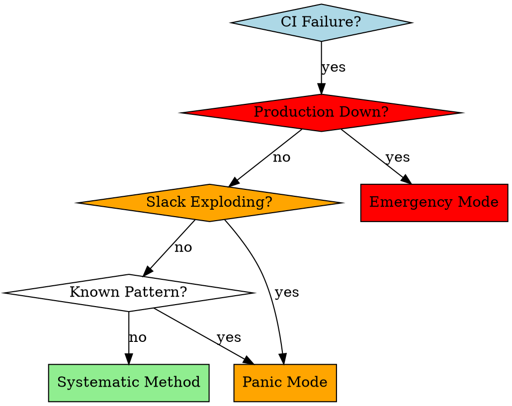

# CI Troubleshooting

## Overview

Systematic methodology for CI failure resolution that prioritizes root cause understanding over surface fixes. Uses parallel subagent analysis for complex issues and three-tier validation before deployment. Based on research showing 61% reduction in pipeline resolution time with AI-assisted systematic approaches.

## When to Use



**Use when:**
- CI pipeline fails with any error pattern
- Build failures (compilation, runtime, test execution)
- Dependency and cache issues (npm, pip, cargo, Nix)
- Infrastructure problems (timeouts, permissions, network)
- Cross-platform compatibility failures
- Unknown or complex error patterns need investigation

**Don't use when:**
- Local development issues (use local debugging)
- Feature development (use TDD skill)
- Code review (use code-reviewer skill)

## Quick Reference

| Phase | Duration | Focus | Key Commands | Success Rate |
|-------|----------|-------|--------------|--------------|
| **Triage** | 2 min | Error categorization | `gh run view --log` | 100% |
| **Dependency** | 5-15 min | Cache/package issues | `make clean` | 85% |
| **Build/Test** | 15-45 min | Deep analysis | Parallel subagents | 75% |
| **Infrastructure** | 10-30 min | Environment issues | `act`, env debug | 80% |
| **Validation** | 5-10 min | Local testing | `act`, `make test` | 90% |

## Core Pattern

**Before:** Apply multiple fixes, push to main, hope it works
**After:** Systematic triage → parallel analysis → local validation → targeted deployment

```bash
# ❌ Anti-pattern: Quick fixes
git add . && git commit -m "fix ci" && git push origin main

# ✅ Pattern: Systematic approach
make triage && make analyze && make validate && make deploy-fix
```

## Systematic Method

### Phase 1: Rapid Triage (2 minutes)

**Objective:** Categorize failure type and select appropriate response strategy

```bash
# Extract error patterns efficiently
latest_run=$(gh run list --limit 1 --json databaseId | jq -r '.[0].databaseId')
failure_type=$(gh run view --log "$latest_run" | grep -E "(error|Error|ERROR)" -A 3 -B 3 | head -20 | \
  grep -E "(dependency|npm|pip|cargo)" && echo "Dependency" || \
  grep -E "(build|compile|test)" && echo "Build/Test" || \
  grep -E "(timeout|permission|network)" && echo "Infrastructure" || \
  echo "Unknown")
```

**Decision Matrix:**
- **Dependency/Cache** → Quick cache clearing (5-15 min)
- **Build/Test** → Parallel subagent analysis (15-45 min)
- **Infrastructure** → Environment debugging (10-30 min)
- **Unknown** → Multi-agent investigation (30-60 min)

### Phase 2: Pattern-Specific Resolution

#### Dependency/Cache Issues (5-15 minutes)

**Symptoms:** npm ERR!, pip install failures, cargo build errors, Nix store corruption

**Systematic Resolution:**
```bash
# Create isolated branch
git checkout -b fix/ci-cache-issue

# Platform-specific cache clearing
case "${{ runner.os }}" in
  macOS)
    npm cache clean --force && rm -rf node_modules package-lock.json
    brew cleanup
    ;;
  Linux)
    npm cache clean --force && rm -rf node_modules package-lock.json
    sudo apt-get clean
    ;;
esac

# Rebuild with clean state
make clean && make build && make test
```

#### Build/Test Failures (15-45 minutes)

**Dispatch parallel subagents for systematic analysis:**

```bash
# Agent 1: Error Pattern Analysis
You're a CI log analyst. Extract and categorize:
- Exact failure point (compilation/runtime/test assertion)
- Warning patterns preceding failure
- Resource usage indicators (memory, disk, time)
- Platform-specific error signatures
- 3 most likely root causes ranked by probability

# Agent 2: Local Environment Reproduction
You're a CI environment specialist. Reproduce failure locally:
- Set up identical environment conditions (OS, dependencies, versions)
- Run specific failing test/command with debug output
- Identify local vs CI environment differences
- Create minimal reproduction case
- Document exact reproduction steps

# Agent 3: Solution Strategy
You're a CI solution architect. Based on error analysis:
- Provide 3 potential solutions ranked by likelihood and risk
- Each solution must be small, testable, and reversible
- Include explicit rollback strategy for each solution
- Estimate implementation time and success probability
- Recommend validation approach
```

**Iterative Resolution Process:**
1. Apply smallest, lowest-risk fix from Agent 3
2. Test locally with exact failing command and environment
3. If fails → rollback immediately, try next solution
4. If passes → validate with `act` to simulate CI environment
5. Repeat until failure resolved or escalate to unknown pattern

#### Infrastructure Issues (10-30 minutes)

**Symptoms:** timeouts, permission denied, network failures, disk space exhaustion

**Systematic Debugging:**
```bash
# Infrastructure diagnostic commands
gh run view --log "$latest_run" | grep -E "(timeout|permission|network|disk space)" -A 5 -B 5

# Environment debugging subagents:
# Environment Analysis: OS differences, dependency versions, environment variables
# Configuration Review: GitHub Actions syntax, cache configuration, secrets, resource limits
# Resource Monitoring: Memory, disk, CPU usage patterns during failure
```

#### Unknown Patterns (30-60 minutes)

**Multi-agent investigation for complex failures:**
- **Log Archaeologist**: Trace exact failure point, identify root cause chain
- **Code Detective**: Analyze recent changes, dependency updates, platform differences
- **External Research**: Search GitHub issues, check changelogs, community solutions
- **Pattern Matcher**: Compare with known failure patterns across similar projects

### Phase 3: Three-Tier Validation

**Level 1: Basic Local Tests**
```bash
# Run exact command that failed in CI
make test  # or npm test, cargo test, etc.
```

**Level 2: Act Environment Simulation**
```bash
# Install: brew install act
act -j <failing-job-name> --bind --verbose
```

**Level 3: QA Validation**
```
You're a senior QA engineer. Validate this CI fix comprehensively:
- Test edge cases that might break from this change
- Verify no new issues introduced in other areas
- Check for performance regressions or resource leaks
- Test on all supported platforms if applicable
- Suggest additional test scenarios for coverage
```

### Phase 4: Safe Deployment

**Pre-deployment Checklist:**
- [ ] Local tests pass with exact failing command
- [ ] Act validation successful (simulates CI environment)
- [ ] Subagent cross-validation complete (multiple agents agree)
- [ ] Fix is minimal and targeted (single change principle)
- [ ] Rollback strategy documented and tested
- [ ] Production impact assessed and communicated

```bash
# Safe deployment pattern
git checkout -b fix/ci-$(date +%Y%m%d-%H%M%S)-$(basename $(pwd))
git add . && git commit -m "fix: resolve $failure_type failure in $CI_JOB_NAME

- Applied systematic troubleshooting methodology
- Validated locally and with act
- Rollback strategy: git revert HEAD

Resolves: #$RUN_ID
🤖 Generated with Claude Code CI Troubleshooting"
git push origin fix/ci-$(date +%Y%m%d-%H%M%S)-$(basename $(pwd))
gh pr create --title "Fix: $failure_type failure in $CI_JOB_NAME" \
  --body "Resolves CI failure in $CI_JOB_NAME. Tested locally and with act validation."
```

## Panic Mode (When Slack Exploding)

**Trigger:** Team pressure, deadlines, production impact
**Response:** Skip systematic methodology, apply targeted fix quickly

1. **Quick Triage** (30 seconds) - Identify most threatening error
2. **Pattern Match** (2-5 minutes) - Find known similar failure
3. **Apply Fix** (3-10 minutes) - Use single, targeted solution
4. **Validate** (2 minutes) - Run only failing command, not full suite
5. **Deploy** (1 minute) - Emergency push to main acceptable
6. **Monitor** (continuous) - Ready to rollback immediately

```bash
# Emergency rollback command always ready
git revert HEAD && git push origin main --force-with-lease
```

**Emergency Communication:** "Applied emergency fix for $issue_type. Monitoring CI. ETA 5 minutes. Ready to rollback if needed."

## Emergency Mode (Production Down)

**Trigger:** Production outage, revenue impact
**Response:** Every second counts, risk accepted

1. **Immediate Pattern Match** (30 seconds)
2. **Apply Most Likely Fix** (2-5 minutes)
3. **Push Directly to Main** (risk accepted)
4. **Monitor and Rollback** (immediate if needed)

**Note:** Only use when production impact exceeds deployment risk.

## Common Mistakes and Anti-Patterns

| Mistake | Symptom | Fix | Root Cause |
|---------|---------|-----|------------|
| Reading full CI logs | Wasted time, information overload | Use grep to extract error patterns only | Information anxiety |
| Multiple simultaneous fixes | Cannot identify which fix worked | Apply one small change, test, repeat | Impatience |
| No local validation | Push broken fixes to CI | Always reproduce failure locally first | Overconfidence |
| Ignoring environment differences | Works locally, fails in CI | Use act to simulate CI environment | Environment assumptions |
| Main branch pollution | Risk of breaking production | Use feature branches unless emergency | Process shortcuts |
| No rollback strategy | Cannot quickly undo bad fixes | Always document and test rollback | Inadequate planning |

## Rationalization Prevention

### Red Flags - STOP and Use Systematic Method

- "This is just a simple fix" → Simple fixes have complex interactions
- "I'll test after pushing" → CI is for validation, not testing
- "It worked on my machine" → Environment differences matter
- "The logs are too long" → Use grep, don't read everything
- "Multiple changes needed" → Single change principle
- "No time for proper process" → Emergency mode exists for this

### Rationalization Reality Check

| Rationalization | Reality | Correct Approach |
|----------------|---------|------------------|
| "It's obviously clear what's wrong" | Clear to you ≠ actually correct | Systematic validation |
| "Multiple fixes will be faster" | Cannot identify root cause | Single change principle |
| "Testing takes too long" | Rollback takes longer | Three-tier validation |
| "This case is different" | Patterns repeat across projects | Learn from past failures |
| "Emergency justifies shortcuts" | Emergency mode exists for real emergencies | Use appropriate mode |

## Success Criteria

- **Root cause identification**: >90% of issues have clear explanation
- **Local reproduction rate**: >80% of CI failures reproduced locally
- **First-pass fix success**: >70% resolve issue on first attempt
- **Knowledge capture**: Every fix documented for future reference
- **Zero production impact**: No fixes break production environment

## Implementation Commands

**Triage Commands:**
```bash
make ci-triage          # Quick error categorization
make ci-analyze         # Deep failure analysis
make ci-validate        # Local validation suite
make ci-deploy-fix      # Safe deployment workflow
```

**Integration with Existing Tools:**
- Uses `make` commands for consistency with existing project structure
- Integrates with GitHub Actions workflow patterns
- Compatible with Nix-based development environments
- Supports cross-platform validation (macOS, Linux x64, Linux ARM)

---

*Systematic approach beats random fixes. Parallel analysis beats sequential debugging. Root cause understanding beats surface patches.*
