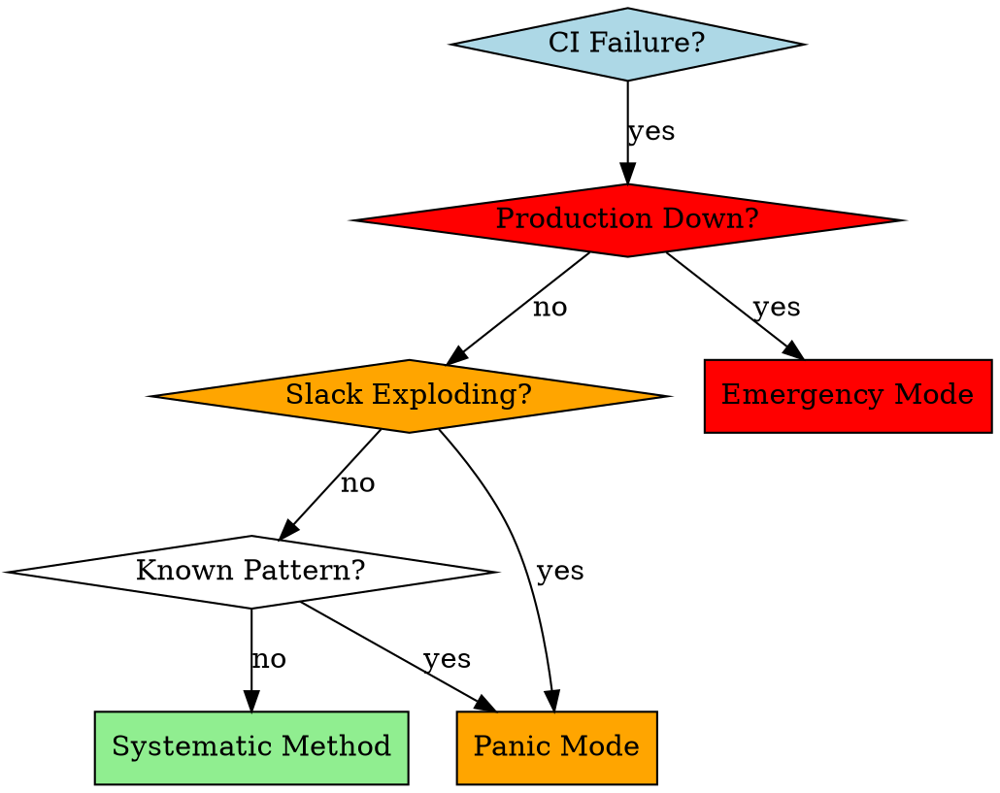

# CI Troubleshooting

## Overview

Systematic methodology for CI failure resolution that prioritizes root cause understanding over surface fixes. Uses parallel subagent analysis for complex issues and three-tier validation before deployment.

## When to Use



**Use when:**
- CI pipeline fails with any error pattern
- Build failures (compilation, runtime, test execution)
- Dependency and cache issues (npm, pip, cargo, Nix)
- Infrastructure problems (timeouts, permissions, network)
- Cross-platform compatibility failures
- Unknown or complex error patterns need investigation

**Don't use when:**
- Local development issues (use local debugging)
- Feature development (use **test-driven-development** skill)
- Code review (use **code-reviewer** skill)

## Core Pattern

**Before:** Apply multiple fixes, push to main, hope it works
**After:** Systematic triage → parallel analysis → local validation → targeted deployment

```bash
# ❌ Anti-pattern: Quick fixes
git add . && git commit -m "fix ci" && git push origin main

# ✅ Pattern: Systematic approach
make triage && make analyze && make validate && make deploy-fix
```

## Quick Reference

| Phase | Duration | Focus | Key Commands | Success Rate |
|-------|----------|-------|--------------|--------------|
| **Triage** | 2 min | Error categorization | `gh run view --log` | 100% |
| **Dependency** | 5-15 min | Cache/package issues | `make clean` | 85% |
| **Build/Test** | 15-45 min | Deep analysis | Parallel subagents | 75% |
| **Infrastructure** | 10-30 min | Environment issues | `act`, env debug | 80% |
| **Validation** | 5-10 min | Local testing | `act`, `make test` | 90% |

## Systematic Method

### Phase 1: Rapid Triage (2 minutes)

```bash
# Extract error patterns quickly
latest_run=$(gh run list --limit 1 --json databaseId | jq -r '.[0].databaseId')
gh run view --log "$latest_run" | grep -E "(error|Error|ERROR)" -A 3 -B 3 | head -20
```

**Categorize immediately:**
- **Dependency/Cache** → npm, pip, cargo cache issues
- **Build/Test** → compilation, runtime, test failures
- **Infrastructure** → timeouts, permissions, network
- **Unknown** → complex patterns needing investigation

### Phase 2: Pattern-Specific Resolution

#### Dependency/Cache Issues (5-15 minutes)
```bash
git checkout -b fix/ci-dependency-issue

# Platform-specific cache clearing
npm cache clean --force && rm -rf node_modules package-lock.json && npm install
# pip cache purge && pip install -r requirements.txt
# cargo clean && cargo build

npm test  # Verify locally
git add . && git commit -m "fix: clear dependency cache - resolves CI build failures"
git push origin fix/ci-dependency-issue
```

#### Build/Test Failures (15-45 minutes)
**Dispatch parallel subagents:**

```bash
# Agent 1: Error Analysis
Analyze these CI error patterns:
- Extract specific failure point (compilation/runtime/test)
- Identify related warnings in logs
- Suggest 3 most likely root causes

# Agent 2: Local Reproduction
Help me reproduce this CI failure locally:
- Set up same environment conditions
- Run specific failing test/command
- Identify local vs CI environment differences
- Create minimal reproduction case

# Agent 3: Solution Strategy
Based on error analysis, provide:
- 3 potential solutions ranked by likelihood
- Each solution should be small, testable change
- Include rollback strategy for each
- Estimate implementation time
```

**Iterative process:**
1. Apply smallest fix from Agent 3
2. Test locally with same failing command
3. If fails → rollback, try next solution
4. If passes → validate with act
5. Repeat until resolved

#### Infrastructure Issues (10-30 minutes)
```bash
gh run view --log "$latest_run" | grep -E "(timeout|permission|network|disk space)"
```

**Subagents for environment debugging:**
- **Environment Analysis**: OS differences, dependency versions, environment variables
- **Configuration Review**: GitHub Actions syntax, cache configuration, secrets, resource limits

#### Unknown Patterns (30-60 minutes)
**Multi-agent investigation:**
- **Log Archaeologist**: Find exact failure point, trace back to root cause
- **Code Detective**: Analyze recent changes, PR diffs, dependency updates
- **External Research**: Search GitHub issues, check changelogs, find community solutions

### Phase 3: Local Validation

**Level 1: Basic Tests**
```bash
npm test  # Run exact command that failed in CI
```

**Level 2: Act Testing**
```bash
# Install: brew install act
act -j <failing-job-name> --bind
```

**Level 3: QA Validation**
```
You're a QA tester. Validate this fix:
- Test edge cases that might break
- Verify no new issues introduced
- Check for performance regressions
- Suggest additional test scenarios
```

### Phase 4: Deployment

**Pre-push checklist:**
- [ ] Local tests pass
- [ ] Act validation successful (if applicable)
- [ ] Subagent cross-validation complete
- [ ] Fix is minimal and targeted
- [ ] Rollback strategy documented

```bash
git checkout -b fix/ci-<issue-description>
git add . && git commit -m "fix: <specific description> - resolves <CI job> failure"
git push origin fix/ci-<issue-description>
gh pr create --title "Fix: <issue>" --body "Resolves CI failure in <job>. Tested locally and with act."
```

## Panic Mode (When Slack Exploding)

**Skip methodology, fight the fire:**

1. **Pick scariest error** (30 seconds) - Build failures first, test failures second
2. **Quick investigation** (2-5 minutes)
   ```bash
   gh run view --log <run-id> | grep -E "(error|Error|ERROR)" -A 5 -B 5 | head -30
   ```
3. **Apply targeted fix** (3-10 minutes) - Use one pattern match
4. **Test specific failure** - Run only failing command, not entire suite
5. **Push if works** - Emergency main branch push acceptable
6. **Monitor closely** - Ready to rollback: `git revert HEAD && git push origin main`

**Emergency communication:** "Applied targeted fix for <specific issue>. Monitoring CI. ETA 5 minutes."

## Emergency Mode (Production Down)

**Production down? Every second counts:**
1. Quick pattern match (30 seconds)
2. Apply most likely fix (2-5 minutes)
3. Push directly to main (risk accepted)
4. Monitor and rollback immediately if needed

## Common Mistakes

| Mistake | Symptom | Fix | Root Cause |
|---------|---------|-----|------------|
| Reading full CI logs | Wasted time, information overload | Use grep to extract error patterns only | Information anxiety |
| Multiple simultaneous fixes | Cannot identify which fix worked | Apply one small change, test, repeat | Impatience |
| No local validation | Push broken fixes to CI | Always reproduce failure locally first | Overconfidence |
| Ignoring environment differences | Works locally, fails in CI | Use act to simulate CI environment | Environment assumptions |
| Main branch pollution | Risk of breaking production | Use feature branches unless emergency | Process shortcuts |
| No rollback strategy | Cannot quickly undo bad fixes | Always document and test rollback | Inadequate planning |

## Rationalization Prevention

### Red Flags - STOP and Use Systematic Method

- "This is just a simple fix" → Simple fixes have complex interactions
- "I'll test after pushing" → CI is for validation, not testing
- "It worked on my machine" → Environment differences matter
- "The logs are too long" → Use grep, don't read everything
- "Multiple changes needed" → Single change principle
- "No time for proper process" → Emergency mode exists for this

**Violating the letter of the rules is violating the spirit of the rules.**

### Rationalization Reality Check

| Rationalization | Reality | Correct Approach |
|----------------|---------|------------------|
| "It's obviously clear what's wrong" | Clear to you ≠ actually correct | Systematic validation |
| "Multiple fixes will be faster" | Cannot identify root cause | Single change principle |
| "Testing takes too long" | Rollback takes longer | Three-tier validation |
| "This case is different" | Patterns repeat across projects | Learn from past failures |
| "Emergency justifies shortcuts" | Emergency mode exists for real emergencies | Use appropriate mode |

## Success Criteria

- **Root cause identification**: >90% of issues have clear explanation
- **Local reproduction rate**: >80% of CI failures reproduced locally
- **First-pass fix success**: >70% resolve issue on first attempt
- **Knowledge capture**: Every fix documented for future reference
- **Zero production impact**: No fixes break production environment

## Implementation Commands

**Triage Commands:**
```bash
make ci-triage          # Quick error categorization
make ci-analyze         # Deep failure analysis
make ci-validate        # Local validation suite
make ci-deploy-fix      # Safe deployment workflow
```

**Integration with Existing Tools:**
- Uses `make` commands for consistency with existing project structure
- Integrates with GitHub Actions workflow patterns
- Compatible with Nix-based development environments
- Supports cross-platform validation (macOS, Linux x64, Linux ARM)

---

*Systematic approach beats random fixes. Parallel analysis beats sequential debugging. Root cause understanding beats surface patches.*
