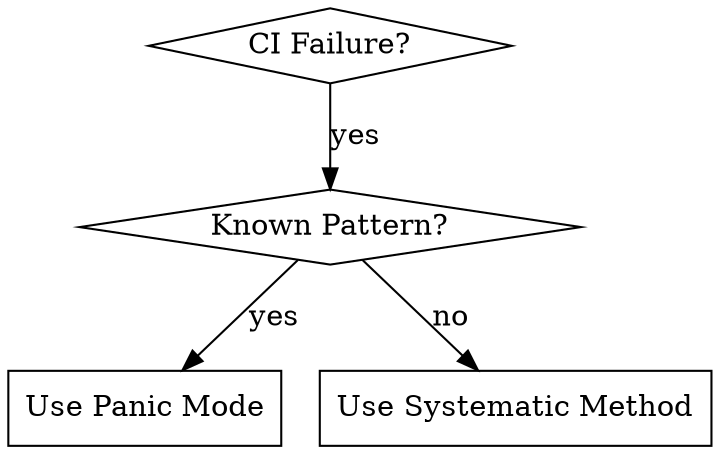

# CI Troubleshooting

## Overview

Systematic methodology for CI failure resolution that prioritizes root cause understanding over quick fixes. Uses subagent parallel analysis for complex issues and local validation before deployment.

## When to Use



**Use when:**
- Build fails with compilation errors
- Tests fail unexpectedly
- Cache/dependency issues occur
- Infrastructure problems (timeouts, permissions)
- Unknown error patterns need investigation

**Don't use when:**
- Local development issues (use local debugging)
- Feature development (use TDD)
- Code review (use code-reviewer skill)

## Quick Reference

| Phase | Duration | Focus | Key Commands |
|-------|----------|-------|--------------|
| **Triage** | 2 min | Error categorization | `gh run view --log` |
| **Dependency** | 5-15 min | Cache/package issues | `npm cache clean` |
| **Build/Test** | 15-45 min | Deep analysis | Subagent parallel |
| **Infrastructure** | 10-30 min | Environment issues | `gh run view` |
| **Validation** | 5-10 min | Local testing | `act`, local tests |

## Systematic Method

### Phase 1: Rapid Triage (2 minutes)

```bash
# Extract error patterns quickly
latest_run=$(gh run list --limit 1 --json databaseId | jq -r '.[0].databaseId')
gh run view --log "$latest_run" | grep -E "(error|Error|ERROR)" -A 3 -B 3 | head -20
```

**Categorize immediately:**
- **Dependency/Cache** → npm, pip, cargo cache issues
- **Build/Test** → compilation, runtime, test failures
- **Infrastructure** → timeouts, permissions, network
- **Unknown** → complex patterns needing investigation

### Phase 2: Pattern-Specific Resolution

#### Dependency/Cache Issues (5-15 minutes)
```bash
git checkout -b fix/ci-dependency-issue

# Platform-specific cache clearing
npm cache clean --force && rm -rf node_modules package-lock.json && npm install
# pip cache purge && pip install -r requirements.txt
# cargo clean && cargo build

npm test  # Verify locally
git add . && git commit -m "fix: clear dependency cache - resolves CI build failures"
git push origin fix/ci-dependency-issue
```

#### Build/Test Failures (15-45 minutes)
**Dispatch parallel subagents:**

```bash
# Agent 1: Error Analysis
Analyze these CI error patterns:
- Extract specific failure point (compilation/runtime/test)
- Identify related warnings in logs
- Suggest 3 most likely root causes

# Agent 2: Local Reproduction
Help me reproduce this CI failure locally:
- Set up same environment conditions
- Run specific failing test/command
- Identify local vs CI environment differences
- Create minimal reproduction case

# Agent 3: Solution Strategy
Based on error analysis, provide:
- 3 potential solutions ranked by likelihood
- Each solution should be small, testable change
- Include rollback strategy for each
- Estimate implementation time
```

**Iterative process:**
1. Apply smallest fix from Agent 3
2. Test locally with same failing command
3. If fails → rollback, try next solution
4. If passes → validate with act
5. Repeat until resolved

#### Infrastructure Issues (10-30 minutes)
```bash
gh run view --log "$latest_run" | grep -E "(timeout|permission|network|disk space)"
```

**Subagents for environment debugging:**
- **Environment Analysis**: OS differences, dependency versions, environment variables
- **Configuration Review**: GitHub Actions syntax, cache configuration, secrets, resource limits

#### Unknown Patterns (30-60 minutes)
**Multi-agent investigation:**
- **Log Archaeologist**: Find exact failure point, trace back to root cause
- **Code Detective**: Analyze recent changes, PR diffs, dependency updates
- **External Research**: Search GitHub issues, check changelogs, find community solutions

### Phase 3: Local Validation

**Level 1: Basic Tests**
```bash
npm test  # Run exact command that failed in CI
```

**Level 2: Act Testing**
```bash
# Install: brew install act
act -j <failing-job-name> --bind
```

**Level 3: QA Validation**
```
You're a QA tester. Validate this fix:
- Test edge cases that might break
- Verify no new issues introduced
- Check for performance regressions
- Suggest additional test scenarios
```

### Phase 4: Deployment

**Pre-push checklist:**
- [ ] Local tests pass
- [ ] Act validation successful (if applicable)
- [ ] Subagent cross-validation complete
- [ ] Fix is minimal and targeted
- [ ] Rollback strategy documented

```bash
git checkout -b fix/ci-<issue-description>
git add . && git commit -m "fix: <specific description> - resolves <CI job> failure"
git push origin fix/ci-<issue-description>
gh pr create --title "Fix: <issue>" --body "Resolves CI failure in <job>. Tested locally and with act."
```

## Panic Mode (When Slack Exploding)

**Skip methodology, fight the fire:**

1. **Pick scariest error** (30 seconds) - Build failures first, test failures second
2. **Quick investigation** (2-5 minutes)
   ```bash
   gh run view --log <run-id> | grep -E "(error|Error|ERROR)" -A 5 -B 5 | head -30
   ```
3. **Apply targeted fix** (3-10 minutes) - Use one pattern match
4. **Test specific failure** - Run only failing command, not entire suite
5. **Push if works** - Emergency main branch push acceptable
6. **Monitor closely** - Ready to rollback: `git revert HEAD && git push origin main`

**Emergency communication:** "Applied targeted fix for <specific issue>. Monitoring CI. ETA 5 minutes."

## Emergency Mode (Production Down)

**Production down? Every second counts:**
1. Quick pattern match (30 seconds)
2. Apply most likely fix (2-5 minutes)
3. Push directly to main (risk accepted)
4. Monitor and rollback immediately if needed

## Common Mistakes

| Mistake | Fix |
|---------|-----|
| Reading full CI logs | Use grep to extract error patterns only |
| Applying multiple fixes at once | Apply one small change, test, repeat |
| Not testing locally before push | Always reproduce failure locally first |
| Ignoring environment differences | Use act to simulate CI environment |
| Pushing to main without branch | Use feature branches unless emergency |

## Success Criteria

- **Root cause identification**: >90% of issues have clear explanation
- **Local reproduction**: >80% of CI failures reproduced locally
- **First-pass fix rate**: >70% resolve issue on first attempt
- **Knowledge capture**: Every fix documented for future reference

---
*Systematic approach beats random fixes every time.*
