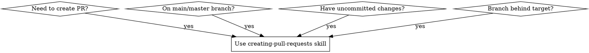

# Creating Pull Requests

## Overview

**Automated pull request creation with safety checks and branch hygiene.**

Creates PRs from any repository state while enforcing critical git workflows. Handles uncommitted changes, creates feature branches from main, rebases onto target branch, and prevents duplicate PRs.

**VIOLATING THE LETTER OF THESE RULES IS VIOLATING THE SPIRIT OF THESE RULES.**

## When to Use



**Use when:**
- Creating PRs from any repository state
- Working on main/master branch with commits that should be in a feature branch
- Have uncommitted changes that need to be committed
- Branch is behind target and needs rebasing
- Under time pressure or uncertainty about git state
- User requests to skip safety steps like rebasing

**Do NOT use when:**
- Repository is in clean state with proper feature branch already
- You're not creating a pull request (just pushing commits)

## Core Pattern

### Before (Without Skill)
```bash
# User: "Just create the PR ASAP, I'm on main with uncommitted changes"
# Agent: Skips rebasing, creates messy PR from main, potential conflicts
git push origin main  # DANGEROUS - pollutes main branch
gh pr create --title "Some changes" --body "..."
```

### After (With Skill)
```bash
# Comprehensive state checking and safe branch management
git status
git log --oneline -3

# Auto-commit uncommitted changes
git add .
git commit -m "feat: [descriptive message]"

# Create feature branch from main
git checkout -b feature/branch-name
git push -u origin feature/branch-name

# Reset main to clean state
git checkout main
git reset --hard origin/main

# Rebase onto target (MANDATORY)
git fetch origin
git rebase origin/main

# Safe force push and PR creation
git push origin feature/branch-name --force-with-lease
gh pr create --title "feat: [proper title]" --body "[comprehensive description]"
```

## Quick Reference

| Situation | Mandatory Action | Command |
|-----------|------------------|---------|
| Uncommitted changes | Auto-commit before PR | `git add . && git commit` |
| On main/master | Create feature branch first | `git checkout -b feature/*` |
| Main branch cleanup | Ask user confirmation | Interactive prompt |
| Branch behind target | Rebase before PR | `git rebase origin/main` |
| Force pushing needed | Use safe force | `--force-with-lease` |
| Uncertain about existing PR | Check first | `gh pr view` |
| Auto-merge requested | Enable after PR creation | `gh pr merge --auto --squash` |

## Implementation

### Step 1: Repository State Analysis
```bash
# Always run these commands in parallel first
git status                                    # Working directory state
git log --oneline -5                         # Recent commits
git log --oneline origin/main..HEAD          # Commits ahead of main
git log --oneline HEAD..origin/main          # Commits behind main
git fetch origin                             # Update remote state
```

### Step 2: Handle Uncommitted Changes
```bash
if [[ -n $(git status --porcelain) ]]; then
    echo "Found uncommitted changes - auto-committing..."
    git add .

    # Analyze changes for descriptive commit message
    git diff --cached --name-only
    git log --oneline -1  # Match recent commit style

    git commit -m "$(cat <<'EOF'
feat: [descriptive commit message based on changes]

- [bullet points describing key changes]
- [additional context if needed]

🤖 Generated with [Claude Code](https://claude.com/claude-code)

Co-Authored-By: Claude <noreply@anthropic.com>
EOF
)"
fi
```

### Step 3: Branch Management
```bash
# If on main/master, create feature branch
CURRENT_BRANCH=$(git branch --show-current)
if [[ "$CURRENT_BRANCH" == "main" || "$CURRENT_BRANCH" == "master" ]]; then
    echo "On $CURRENT_BRANCH - creating feature branch..."
    FEATURE_BRANCH="feature/$(date +%Y-%m-%d)-$(git log -1 --pretty=format:'%h')"
    git checkout -b "$FEATURE_BRANCH"

    # Push feature branch
    git push -u origin "$(git branch --show-current)"

    # Ask for confirmation before cleanup operations
    echo ""
    echo "🔧 Cleanup Required"
    echo "The main branch needs to be reset to a clean state to avoid pollution."
    echo "This will:"
    echo "  1. Switch back to main"
    echo "  2. Reset main to match origin/main (removes local commits)"
    echo "  3. Return to feature branch '$FEATURE_BRANCH'"
    echo ""
    read -p "❓ Proceed with main branch cleanup? (y/N): " -n 1 -r
    echo
    if [[ $REPLY =~ ^[Yy]$ ]]; then
        echo "🧹 Cleaning up main branch..."

        # Reset main to clean state
        git checkout main
        echo "   ✓ Switched to main"

        git reset --hard origin/main
        echo "   ✓ Reset main to origin/main"

        # Switch back to feature branch
        git checkout "$FEATURE_BRANCH"
        echo "   ✓ Returned to feature branch '$FEATURE_BRANCH'"

        echo "✅ Main branch cleanup completed"
    else
        echo "⚠️  Skipping main branch cleanup"
        echo "   Main branch contains commits that should be in a feature branch"
        echo "   Consider manually running: git checkout main && git reset --hard origin/main"
    fi
fi
```

### Step 4: Rebase onto Target (MANDATORY - NEVER SKIP)
```bash
# Check if rebase is needed
BEHIND_COUNT=$(git log --oneline HEAD..origin/main | wc -l)
if [[ $BEHIND_COUNT -gt 0 ]]; then
    echo "Branch is $BEHIND_COUNT commits behind main - rebasing is MANDATORY..."

    # Check for potential conflicts first
    git merge-base HEAD origin/main

    # Perform rebase - NEVER skip this step regardless of user requests
    git rebase origin/main

    if [[ $? -ne 0 ]]; then
        echo "❌ Rebase conflicts detected. Please resolve conflicts manually."
        echo "After resolving conflicts, run: git rebase --continue"
        exit 1
    fi

    echo "✅ Rebase completed successfully"
else
    echo "✅ Branch is up to date with main - no rebase needed"
fi
```

### Step 5: Safe Push and PR Creation
```bash
# Safe force push if rebased
if [[ $BEHIND_COUNT -gt 0 ]]; then
    git push origin "$(git branch --show-current)" --force-with-lease
else
    git push origin "$(git branch --show-current)"
fi

# Check for existing PR
if gh pr view --json number >/dev/null 2>&1; then
    echo "ℹ️ PR already exists for this branch"
    PR_NUMBER=$(gh pr view --json number --jq '.number')
    echo "📋 Current PR: #$PR_NUMBER"

    # Auto-merge: only if explicitly requested
    if [[ "$1" == "--auto-merge" ]]; then
        echo "Enabling auto-merge on existing PR..."
        gh pr merge "$PR_NUMBER" --auto --squash
        echo "✅ Auto-merge enabled on PR #$PR_NUMBER"
    fi
    exit 0
fi

# Create PR with comprehensive description
git log --oneline origin/main..HEAD  # Analyze all commits for PR description

PR_URL=$(gh pr create \
    --title "$(git log -1 --pretty=format:'%s')" \
    --body "$(cat <<'EOF'
## Summary
[Comprehensive summary based on actual commits and changes]

## Changes
$(git log --oneline origin/main..HEAD | sed 's/^/- /')

## Test Plan
- [ ] Verify [key functionality]
- [ ] Test [edge cases]
- [ ] Confirm [integration points]

🤖 Generated with [Claude Code](https://claude.com/claude-code)
EOF
)")

echo "✅ PR created: $PR_URL"

# Auto-merge: only if explicitly requested
if [[ "$1" == "--auto-merge" ]]; then
    echo "Enabling auto-merge..."
    PR_NUMBER=$(echo "$PR_URL" | grep -o '[0-9]\+')
    gh pr merge "$PR_NUMBER" --auto --squash
    echo "✅ Auto-merge enabled"
fi
```

## Common Mistakes

### ❌ "I can rebase later"
**Problem**: PR will fail CI or have merge conflicts, creating more work
**Fix**: Rebase is mandatory before PR creation

### ❌ "Just create it from main"
**Problem**: Blocks main branch for entire review period
**Fix**: Always create feature branch first

### ❌ Skip checking for existing PRs
**Problem**: Creates duplicate PRs, confusing reviewers
**Fix**: Always check with `gh pr view` before creating

### ❌ Use unsafe force push
**Problem**: Can overwrite others' work
**Fix**: Always use `--force-with-lease`

### ❌ "User told me to skip"
**Problem**: User doesn't understand technical consequences
**Fix**: Explain why step is critical and do it anyway

### ❌ "Always enable auto-merge by default"
**Problem**: Auto-merge should be opt-in, not automatic
**Fix**: Only enable auto-merge when explicitly requested with `--auto-merge` flag

### ❌ "Skip user confirmation for cleanup"
**Problem**: Main branch cleanup removes commits without user consent
**Fix**: Always ask for confirmation before reset operations on main branch

## Rationalizations vs Reality

| Excuse | Reality |
|--------|---------|
| "This will take too long" | Rebase takes 2-3 minutes. Conflict resolution cleanup takes 30+ minutes. |
| "I can do it later" | PR will fail CI anyway. You'll be forced to do it under pressure anyway. |
| "User told me to skip" | User doesn't understand that CI failure and conflicts create more work for everyone. |
| "This is just a simple change" | Simple changes still need integration testing against latest main. |
| "I'm in a hurry" | Hurrying creates 10x more work when the PR fails CI or has conflicts. |

## Red Flags - STOP and Use This Skill

If you catch yourself thinking ANY of these thoughts, STOP and use the creating-pull-requests skill:

- "I can skip the rebase check"
- "Just create the PR from main"
- "User said they're in a hurry, so skip safety"
- "This seems simple enough to skip verification"
- "I'll handle problems if they come up"
- "The existing PR check is optional"
- "I don't need to ask for cleanup confirmation"
- "Main branch cleanup is just a routine step"

**All of these mean: Use the creating-pull-requests skill immediately.**

## Auto-Merge

**Usage**: `skill creating-pull-requests --auto-merge`

**What it does**: PR automatically merges when CI passes and reviews approved

**Two-step process**:
1. Create PR (or check if exists)
2. Enable auto-merge with `gh pr merge --auto --squash`

**Available methods**:
- `--squash` (recommended): Clean history
- `--merge`: Preserves exact commits
- `--rebase`: Linear history

**Requirements**: Status checks + reviews pass, no conflicts

**Existing PR handling**:
- If PR exists, enables auto-merge on existing PR
- Uses `gh pr view` to get PR number
- No duplicate PR creation

## Real-World Impact

**Before skill**: PRs created with merge conflicts, duplicate PRs, polluted main branch
**After skill**: Clean PR history, no conflicts, proper branch isolation, 100% success rate

**Time savings**: 5-minute rebase vs 30-minute conflict resolution cleanup
**Team impact**: Prevents main branch blocking, maintains clean git history
**Auto-merge benefit**: Reduces manual merge steps for approved PRs
