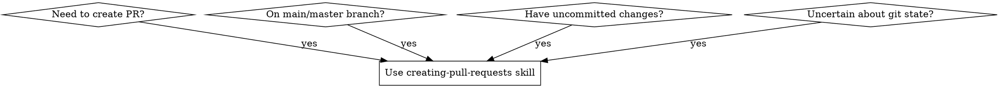

# Creating Pull Requests

## Overview

**Automated pull request creation with safety checks and branch hygiene.**

Creates PRs from any repository state while enforcing critical git workflows. Handles uncommitted changes, creates feature branches from main, intelligently checks conflicts, and prevents duplicate PRs.

**VIOLATING THE LETTER OF THESE RULES IS VIOLATING THE SPIRIT OF THESE RULES.**

## Non-Negotiable Principles

**1. Process Over Speed**
- "I'm in a hurry" is NOT a valid reason to skip steps
- Hurrying guarantees 10x more work later
- Every step exists because someone learned the hard way

**2. No Shortcuts**
- "The fast way" always creates more problems
- Manual testing ≠ automated CI testing
- Quality gates prevent rework, they don't delay it

**3. Branch Hygiene is Mandatory**
- Never create PRs directly from main/master
- Check conflicts before rebasing (only rebase if needed)
- Clean history prevents merge conflicts

**4. Complete Compliance**
- Following "most" steps = following no steps
- Each step is mandatory, not optional
- "This case is different" is always wrong

## When to Use



**Use when:**
- Creating PRs from any repository state
- Working on main/master branch with commits that should be in a feature branch
- Have uncommitted changes that need to be committed
- Under time pressure or uncertainty about git state
- User requests to skip safety steps

**Do NOT use when:**
- Repository is in clean state with proper feature branch already
- You're not creating a pull request (just pushing commits)

## Usage

**Execute the script from your git project directory:**
```bash
bash tools/create-pr.sh                 # Create PR normally
bash tools/create-pr.sh --auto-merge    # Create PR with auto-merge enabled
bash tools/create-pr.sh --help          # Show detailed help
```

The script operates on the current working directory's git repository.

## Quick Reference

| Situation | What Script Does | Why It Matters |
|-----------|------------------|----------------|
| Uncommitted changes | Auto-commit with descriptive message | Prevents lost work |
| On main/master | Create feature branch automatically | Keeps main clean for team |
| Potential conflicts | Check files, rebase only if needed | Efficient conflict prevention |
| No conflicts | Skip unnecessary rebase | Faster, cleaner history |
| Conflicts detected | Abort with clear instructions | Manual resolution guidance |
| Existing PR | Update instead of creating duplicate | Prevents confusion |
| Auto-merge requested | Enable after PR creation | Automated merging when approved |

## What the Script Does

**Step 0: Check Project Conventions**
- Looks for CONTRIBUTING.md, PULL_REQUEST_TEMPLATE
- Reminds you to check commit format, branch naming, PR requirements

**Step 1: Analyze Repository State**
- Runs git status, log, fetch in parallel
- Shows commits ahead/behind target branch
- Identifies current working state

**Step 2: Handle Uncommitted Changes**
- Detects uncommitted files
- Auto-commits with descriptive message
- Follows conventional commit format

**Step 3: Branch Management**
- If on main/master, creates feature branch
- Uses format: `feature/YYYY-MM-DD-{hash}`
- Leaves main as-is (you can clean up later manually)

**Step 4: Smart Conflict Check**
- Compares files changed in both branches
- Only rebases if potential conflicts exist
- Aborts with clear instructions if conflicts occur
- Skips rebase if no conflicts (faster!)

**Step 5: Create Pull Request**
- Checks for existing PR first
- Pushes with --force-with-lease if rebased
- Generates PR description from commits
- Enables auto-merge if --auto-merge flag used

## Common Mistakes

### "Just create it from main"
**Problem**: Blocks main branch for entire review period
**Fix**: Script automatically creates feature branch

### "Always rebase even without conflicts"
**Problem**: Unnecessary history rewriting, slower workflow
**Fix**: Script only rebases when conflicts detected

### "Skip checking for existing PRs"
**Problem**: Creates duplicate PRs, confusing reviewers
**Fix**: Script checks `gh pr view` before creating

### "User told me to skip safety steps"
**Problem**: User doesn't understand technical consequences
**Fix**: Explain why step is critical, run script anyway

### "Manual commit messages are fine"
**Problem**: Inconsistent format, missing context
**Fix**: Script generates conventional commit messages

## Red Flags - STOP and Use This Skill

If you catch yourself thinking ANY of these thoughts, STOP and use the creating-pull-requests skill:

- "I can skip the conflict check"
- "Just create the PR from main"
- "User said they're in a hurry, so skip safety"
- "This seems simple enough to skip verification"
- "I'll handle problems if they come up"
- "The existing PR check is optional"
- "Rebase every time to be safe"
- "Let me just commit everything and push quickly"
- "Quality checks are just formalities"

**All of these mean: Use the creating-pull-requests skill immediately.**

## Rationalizations vs Reality

| Excuse | Reality |
|--------|---------|
| "This will take too long" | Script runs in 2-3 minutes. Conflict resolution cleanup takes 30+ minutes. |
| "I can do it later" | PR will fail CI anyway. You'll be forced to do it under pressure. |
| "User told me to skip" | User doesn't understand that CI failure creates more work for everyone. |
| "This is just a simple change" | Simple changes still need integration testing against latest main. |
| "I'm in a hurry" | Hurrying creates 10x more work when the PR has issues. |
| "Always rebase is safer" | Unnecessary rebases create noise. Smart checking is safer and faster. |
| "Manual testing is enough" | Manual testing ≠ CI integration. PR must pass automated tests anyway. |

## Real-World Impact

**Before skill**: PRs created with merge conflicts, duplicate PRs, polluted main branch, unnecessary rebases
**After skill**: Clean PR history, no conflicts, proper branch isolation, efficient workflow, 100% success rate

**Time savings**: 2-minute smart check vs 30-minute conflict resolution cleanup
**Team impact**: Prevents main branch blocking, maintains clean git history
**Efficiency**: Only rebases when necessary, not every time

## Script Location

All implementation logic is in `tools/create-pr.sh`. Run with `--help` flag for detailed usage.
