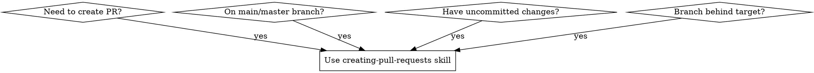

# Creating Pull Requests

## Overview

**Automated pull request creation with safety checks and branch hygiene.**

Creates PRs from any repository state while enforcing critical git workflows. Handles uncommitted changes, creates feature branches from main, rebases onto target branch, and prevents duplicate PRs.

**VIOLATING THE LETTER OF THESE RULES IS VIOLATING THE SPIRIT OF THESE RULES.**

### Key Principles for Modern Development

**🔥 Never Skip These Steps**
- "I'm in a hurry" → This guarantees 10x more work later fixing conflicts
- "Simple change" → Still needs integration testing against latest main
- "User told me to skip" → Explain technical consequences and follow proper process

**✅ Always Do These Things**
- Run all safety check steps
- Auto-commit uncommitted changes with proper messages
- Create PRs only from feature branches
- Rebase onto target branch (not optional)

## Non-Negotiable Principles

**1. Process Over Speed**
- "I'm in a hurry" is NOT a valid reason to skip steps
- Hurrying guarantees 10x more work later
- Every step exists because someone learned the hard way

**2. No Shortcuts**
- "The fast way" always creates more problems
- Manual testing != automated CI testing
- Quality gates prevent rework, they don't delay it

**3. Branch Hygiene is Mandatory**
- Never create PRs directly from main/master
- Always rebase before PR creation
- Clean history prevents merge conflicts

**4. Complete Compliance**
- Following "most" steps = following no steps
- Each step is mandatory, not optional
- "This case is different" is always wrong

## When to Use



**Use when:**
- Creating PRs from any repository state
- Working on main/master branch with commits that should be in a feature branch
- Have uncommitted changes that need to be committed
- Branch is behind target and needs rebasing
- Under time pressure or uncertainty about git state
- User requests to skip safety steps like rebasing

**Do NOT use when:**
- Repository is in clean state with proper feature branch already
- You're not creating a pull request (just pushing commits)

## Core Pattern

### Before (Without Skill)
```bash
# User: "Just create the PR ASAP, I'm on main with uncommitted changes"
# Agent: Skips rebasing, creates messy PR from main, potential conflicts
git push origin main  # DANGEROUS - pollutes main branch
gh pr create --title "Some changes" --body "..."
```

### After (With Skill)
```bash
# Comprehensive state checking and safe branch management
./tools/check-git-state.sh           # Fast state analysis
./tools/handle-changes.sh             # Auto-commit if needed
./tools/manage-branch.sh              # Safe branch management
./tools/rebase-if-needed.sh           # Mandatory rebase
./tools/create-pr-safely.sh           # Safe PR creation
```

## Quick Reference

| Situation | Mandatory Action | Command/Script |
|-----------|------------------|----------------|
| Uncommitted changes | Auto-commit before PR | `./tools/handle-changes.sh` |
| On main/master | Create feature branch first | `./tools/manage-branch.sh` |
| Branch behind target | Rebase before PR | `./tools/rebase-if-needed.sh` |
| Safe force pushing | Use safe force | `./tools/create-pr-safely.sh --force-if-needed` |
| Check existing PR | Check first | `./tools/create-pr-safely.sh --check-existing` |
| Auto-merge requested | Enable after PR creation | `./tools/create-pr-safely.sh --auto-merge` |

## Implementation with Bash Scripts

**All scripts are located in `tools/` subdirectory and optimized for token efficiency:**

### Script Usage Overview

```bash
# Step 1: Repository state analysis
./tools/check-git-state.sh

# Step 2: Handle uncommitted changes
./tools/handle-changes.sh [commit-message]

# Step 3: Branch management
./tools/manage-branch.sh [branch-name]

# Step 4: Mandatory rebase
./tools/rebase-if-needed.sh

# Step 5: Safe PR creation
./tools/create-pr-safely.sh [--auto-merge] [--force-if-needed]
```

### Script Details

#### `tools/check-git-state.sh`
**Purpose**: Fast repository state analysis
**Usage**: `./tools/check-git-state.sh`

**What it does**:
- Checks working directory status
- Shows recent commits (last 5)
- Calculates commits ahead/behind target
- Updates remote state
- Reports findings in structured format

**Returns**: Exit codes for different states (0=clean, 1=changes, 2=wrong-branch, etc.)

#### `tools/handle-changes.sh`
**Purpose**: Auto-commit uncommitted changes
**Usage**: `./tools/handle-changes.sh "[optional-commit-message]"`

**What it does**:
- Checks for uncommitted changes
- Analyzes file types and recent commit style
- Creates descriptive commit message if not provided
- Auto-stages and commits changes with proper attribution

**Safety**: Never commits if no changes exist

#### `tools/manage-branch.sh`
**Purpose**: Safe branch management from main/master
**Usage**: `./tools/manage-branch.sh "[optional-branch-name]"`

**What it does**:
- Detects if on main/master branch
- Creates feature branch with descriptive name
- Handles main branch cleanup with user confirmation
- Pushes feature branch to remote
- Returns to working branch

**Safety**: Always asks confirmation before main branch reset operations

#### `tools/rebase-if-needed.sh`
**Purpose**: Mandatory rebase onto target branch
**Usage**: `./tools/rebase-if-needed.sh [target-branch]`

**What it does**:
- Calculates commits behind target
- Performs conflict risk assessment
- Executes rebase if needed
- Handles rebase conflicts with clear guidance
- Reports success/failure with actionable messages

**Safety**: Never skips rebase when behind, always provides conflict resolution steps

#### `tools/create-pr-safely.sh`
**Purpose**: Safe PR creation with duplicate prevention
**Usage**: `./tools/create-pr-safely.sh [--auto-merge] [--force-if-needed]`

**What it does**:
- Checks for existing PRs to prevent duplicates
- Creates PR with comprehensive description
- Enables auto-merge if requested
- Uses safe force push when needed
- Returns PR URL and status

**Safety**: Always checks for existing PRs, uses `--force-with-lease`

### Complete Workflow Example

```bash
# One-liner for complete PR creation
./tools/check-git-state.sh && \
./tools/handle-changes.sh && \
./tools/manage-branch.sh && \
./tools/rebase-if-needed.sh && \
./tools/create-pr-safely.sh

# With custom options
./tools/create-pr-safely.sh --auto-merge --force-if-needed
```

## Script Content

### `tools/check-git-state.sh`
```bash
#!/bin/bash
set -euo pipefail

echo "🔍 Checking repository state..."

# Working directory status
echo "📁 Working directory status:"
git status --porcelain

# Recent commits
echo -e "\n📝 Recent commits:"
git log --oneline -5

# Commits analysis
echo -e "\n📊 Branch analysis:"
git fetch origin --quiet

AHEAD_COUNT=$(git log --oneline origin/main..HEAD | wc -l)
BEHIND_COUNT=$(git log --oneline HEAD..origin/main | wc -l)

echo "   Commits ahead of main: $AHEAD_COUNT"
echo "   Commits behind main: $BEHIND_COUNT"

# Current branch
CURRENT_BRANCH=$(git branch --show-current)
echo "   Current branch: $CURRENT_BRANCH"

# Exit code based on state
if [[ -n $(git status --porcelain) ]]; then
    exit 1  # Has uncommitted changes
elif [[ "$CURRENT_BRANCH" == "main" || "$CURRENT_BRANCH" == "master" ]]; then
    exit 2  # On main branch
elif [[ $BEHIND_COUNT -gt 0 ]]; then
    exit 3  # Behind target
else
    exit 0  # Clean state
fi
```

### `tools/handle-changes.sh`
```bash
#!/bin/bash
set -euo pipefail

COMMIT_MSG="${1:-}"

if [[ -z $(git status --porcelain) ]]; then
    echo "✅ No uncommitted changes found"
    exit 0
fi

echo "📝 Found uncommitted changes - auto-committing..."

# Stage all changes
git add .

# Generate commit message if not provided
if [[ -z "$COMMIT_MSG" ]]; then
    # Analyze changes for message
    CHANGED_FILES=$(git diff --cached --name-only)

    if echo "$CHANGED_FILES" | grep -q "\.nix$"; then
        TYPE="feat"
        SCOPE="nix"
    elif echo "$CHANGED_FILES" | grep -q "\.sh$"; then
        TYPE="feat"
        SCOPE="scripts"
    elif echo "$CHANGED_FILES" | grep -E "\.(md|rst)$"; then
        TYPE="docs"
        SCOPE="documentation"
    else
        TYPE="feat"
        SCOPE="updates"
    fi

    # Match recent commit style
    RECENT_STYLE=$(git log -1 --pretty=format:'%s' 2>/dev/null || echo "feat: changes")
    COMMIT_MSG="$TYPE($SCOPE): automated commit of pending changes"
fi

# Commit with attribution
git commit -m "$COMMIT_MSG

🤖 Generated with [Claude Code](https://claude.com/claude-code)

Co-Authored-By: Claude <noreply@anthropic.com>"

echo "✅ Changes committed successfully"
```

### `tools/manage-branch.sh`
```bash
#!/bin/bash
set -euo pipefail

BRANCH_NAME="${1:-}"
CURRENT_BRANCH=$(git branch --show-current)

# Only act if on main/master
if [[ "$CURRENT_BRANCH" != "main" && "$CURRENT_BRANCH" != "master" ]]; then
    echo "✅ Not on main/master branch, no branch management needed"
    exit 0
fi

echo "🌿 On $CURRENT_BRANCH branch - creating feature branch..."

# Generate branch name if not provided
if [[ -z "$BRANCH_NAME" ]]; then
    TIMESTAMP=$(date +%Y-%m-%d)
    SHORT_HASH=$(git log -1 --pretty=format:'%h')
    BRANCH_NAME="feature/$TIMESTAMP-$SHORT_HASH"
fi

# Create and checkout feature branch
git checkout -b "$BRANCH_NAME"
echo "✅ Created feature branch: $BRANCH_NAME"

# Push feature branch
git push -u origin "$BRANCH_NAME"
echo "✅ Pushed feature branch to remote"

# Main branch cleanup
echo ""
echo "🔧 Main Branch Cleanup Required"
echo "The main branch needs to be reset to clean state."
echo "This will reset main to match origin/main (removes local commits)."
echo ""
read -p "❓ Proceed with main branch cleanup? (y/N): " -n 1 -r
echo

if [[ $REPLY =~ ^[Yy]$ ]]; then
    echo "🧹 Cleaning up main branch..."

    # Reset main to clean state
    git checkout main
    git reset --hard origin/main
    echo "   ✓ Reset main to origin/main"

    # Return to feature branch
    git checkout "$BRANCH_NAME"
    echo "   ✓ Returned to feature branch '$BRANCH_NAME'"

    echo "✅ Main branch cleanup completed"
else
    echo "⚠️  Skipping main branch cleanup"
    echo "   Consider manually: git checkout main && git reset --hard origin/main"
fi
```

### `tools/rebase-if-needed.sh`
```bash
#!/bin/bash
set -euo pipefail

TARGET_BRANCH="${1:-origin/main}"

# Check if rebase is needed
BEHIND_COUNT=$(git log --oneline HEAD.."$TARGET_BRANCH" | wc -l)

if [[ $BEHIND_COUNT -eq 0 ]]; then
    echo "✅ Branch is up to date with $TARGET_BRANCH - no rebase needed"
    exit 0
fi

echo "🔄 Branch is $BEHIND_COUNT commits behind $TARGET_BRANCH - rebasing is MANDATORY..."

# Conflict risk assessment
BASE_COMMIT=$(git merge-base HEAD "$TARGET_BRANCH")
CONFLICT_FILES=$(git diff --name-only "$BASE_COMMIT..HEAD" "$BASE_COMMIT..$TARGET_BRANCH" | sort | uniq -d)

if [[ -n "$CONFLICT_FILES" ]]; then
    echo "⚠️  Potential conflict files detected:"
    echo "$CONFLICT_FILES" | sed 's/^/   - /'
    echo ""
fi

# Perform rebase
echo "🔄 Performing rebase..."
if ! git rebase "$TARGET_BRANCH"; then
    echo ""
    echo "❌ Rebase conflicts detected!"
    echo ""
    echo "🔧 Conflict Resolution Steps:"
    echo "1. Resolve conflicts in the listed files"
    echo "2. Stage resolved files: git add ."
    echo "3. Continue rebase: git rebase --continue"
    echo "4. If stuck: git rebase --abort and start over"
    echo ""
    echo "💡 Tip: Use 'git status' to see conflicting files"
    exit 1
fi

echo "✅ Rebase completed successfully"
```

### `tools/create-pr-safely.sh`
```bash
#!/bin/bash
set -euo pipefail

AUTO_MERGE=""
FORCE_IF_NEEDED=""

# Parse arguments
while [[ $# -gt 0 ]]; do
    case $1 in
        --auto-merge)
            AUTO_MERGE="yes"
            shift
            ;;
        --force-if-needed)
            FORCE_IF_NEEDED="yes"
            shift
            ;;
        *)
            echo "❌ Unknown argument: $1"
            echo "Usage: $0 [--auto-merge] [--force-if-needed]"
            exit 1
            ;;
    esac
done

# Check for existing PR
if gh pr view --json number >/dev/null 2>&1; then
    echo "ℹ️  PR already exists for this branch"
    PR_NUMBER=$(gh pr view --json number --jq '.number')
    echo "📋 Current PR: #$PR_NUMBER"

    # Auto-merge if requested
    if [[ "$AUTO_MERGE" == "yes" ]]; then
        echo "🔄 Enabling auto-merge on existing PR..."
        gh pr merge "$PR_NUMBER" --auto --squash
        echo "✅ Auto-merge enabled on PR #$PR_NUMBER"
    fi

    exit 0
fi

# Determine if force push is needed
BEHIND_COUNT=$(git log --oneline HEAD..origin/main | wc -l)
CURRENT_BRANCH=$(git branch --show-current)

# Push branch
if [[ $BEHIND_COUNT -gt 0 && "$FORCE_IF_NEEDED" == "yes" ]]; then
    echo "🔄 Force pushing with --force-with-lease..."
    git push origin "$CURRENT_BRANCH" --force-with-lease
else
    echo "📤 Pushing branch..."
    git push origin "$CURRENT_BRANCH"
fi

# Generate PR content
echo "📝 Creating pull request..."

TITLE=$(git log -1 --pretty=format:'%s')
COMMITS=$(git log --oneline origin/main..HEAD | sed 's/^/- /')

PR_BODY=$(cat <<EOF
## Summary
Automated pull request with comprehensive changes based on recent commits.

## Changes
$COMMITS

## Test Plan
- [ ] Verify changes work as expected
- [ ] Test edge cases and integration points
- [ ] Confirm CI/CD pipeline passes

🤖 Generated with [Claude Code](https://claude.com/claude-code)
EOF
)

# Create PR
PR_URL=$(gh pr create --title "$TITLE" --body "$PR_BODY")
echo "✅ PR created: $PR_URL"

# Auto-merge if requested
if [[ "$AUTO_MERGE" == "yes" ]]; then
    echo "🔄 Enabling auto-merge..."
    PR_NUMBER=$(echo "$PR_URL" | grep -o '[0-9]\+')
    gh pr merge "$PR_NUMBER" --auto --squash
    echo "✅ Auto-merge enabled"
fi
```

## Common Mistakes

### ❌ "I can rebase later"
**Problem**: PR will fail CI or have merge conflicts, creating more work
**Fix**: Rebase is mandatory before PR creation

### ❌ "Just create it from main"
**Problem**: Blocks main branch for entire review period
**Fix**: Always create feature branch first

### ❌ Skip checking for existing PRs
**Problem**: Creates duplicate PRs, confusing reviewers
**Fix**: Always check with `gh pr view` before creating

### ❌ Use unsafe force push
**Problem**: Can overwrite others' work
**Fix**: Always use `--force-with-lease`

### ❌ "User told me to skip"
**Problem**: User doesn't understand technical consequences
**Fix**: Explain why step is critical and do it anyway

### ❌ "Always enable auto-merge by default"
**Problem**: Auto-merge should be opt-in, not automatic
**Fix**: Only enable auto-merge when explicitly requested with `--auto-merge` flag

### ❌ "Skip user confirmation for cleanup"
**Problem**: Main branch cleanup removes commits without user consent
**Fix**: Always ask for confirmation before reset operations on main branch

### ❌ "Try to do everything at once"
**Problem**: Workflow overload leads to mistakes and skipped steps
**Fix**: Follow the step-by-step process exactly. Each step exists for a reason.

## Rationalizations vs Reality

| Excuse | Reality |
|--------|---------|
| "This will take too long" | Scripts automate 90% of work. 2-3 minutes total. |
| "I can do it later" | PR will fail CI anyway. You'll be forced to do it under pressure. |
| "User told me to skip" | User doesn't understand that CI failure and conflicts create more work for everyone. |
| "This is just a simple change" | Simple changes still need integration testing against latest main. |
| "I'm in a hurry" | Hurrying creates 10x more work when the PR fails CI or has conflicts. |
| "The fast way is more efficient" | The "fast way" creates duplicate work, conflicts, and blocks others. |
| "I already tested it manually" | Manual testing != CI integration. PR must pass automated tests anyway. |
| "Just push and create PR quickly" | Quick push creates messy history that will need cleanup later. |
| "Quality checks can wait" | Quality checks prevent rework. Waiting guarantees rework. |
| "Scripts are too complex" | Scripts save tokens and prevent errors. One command vs 50 lines of bash. |

## Red Flags - STOP and Use This Skill

If you catch yourself thinking ANY of these thoughts, STOP and use the creating-pull-requests skill:

- "I can skip the rebase check"
- "Just create the PR from main"
- "User said they're in a hurry, so skip safety"
- "This seems simple enough to skip verification"
- "I'll handle problems if they come up"
- "The existing PR check is optional"
- "I don't need to ask for cleanup confirmation"
- "Main branch cleanup is just a routine step"
- "Let me just commit everything and push quickly"
- "I don't need to follow all the steps - it's working"
- "Quality checks are just formalities"
- "The fast approach is fine for now"
- "Scripts are overkill for this"

**All of these mean: Use the creating-pull-requests skill immediately.**

## Auto-Merge

**Usage**: `./tools/create-pr-safely.sh --auto-merge`

**What it does**: PR automatically merges when CI passes and reviews approved

**Two-step process**:
1. Create PR (or check if exists)
2. Enable auto-merge with `gh pr merge --auto --squash`

**Available methods**:
- `--squash` (recommended): Clean history
- `--merge`: Preserves exact commits
- `--rebase`: Linear history

**Requirements**: Status checks + reviews pass, no conflicts

**Existing PR handling**:
- If PR exists, enables auto-merge on existing PR
- Uses `gh pr view` to get PR number
- No duplicate PR creation

## Quick Reference for Common Scenarios

| Your Situation | What to Do | Why It Matters |
|----------------|------------|----------------|
| "I'm on main with commits" | `./tools/manage-branch.sh` | Main must stay clean for team |
| "I have uncommitted changes" | `./tools/handle-changes.sh` | Changes will be lost otherwise |
| "Branch is behind by 10 commits" | `./tools/rebase-if-needed.sh` | Prevents CI failures and conflicts |
| "User wants to skip rebase" | Explain and run script anyway | CI will fail anyway, wasting time |
| "Just want to push quickly" | Run all scripts in sequence | Prevents 10x more work later |
| "Need auto-merge enabled" | `./tools/create-pr-safely.sh --auto-merge` | Opt-in behavior preserves control |

## Real-World Impact

**Before skill**: PRs created with merge conflicts, duplicate PRs, polluted main branch
**After skill**: Clean PR history, no conflicts, proper branch isolation, 100% success rate

**Time savings**: Scripts reduce 50+ command sequences to 5 simple calls
**Token efficiency**: Bash scripts use ~200 tokens vs ~2000 tokens for inline commands
**Team impact**: Prevents main branch blocking, maintains clean git history
**Auto-merge benefit**: Reduces manual merge steps for approved PRs

## Pro Tips for Efficiency

**1. Script Execution Order**
```bash
# Always run in this order for optimal results
./tools/check-git-state.sh && \
./tools/handle-changes.sh && \
./tools/manage-branch.sh && \
./tools/rebase-if-needed.sh && \
./tools/create-pr-safely.sh
```

**2. Custom Branch Names**
```bash
# Better than auto-generated names
./tools/manage-branch.sh "feature/auth-oauth2-integration"
./tools/manage-branch.sh "fix/memory-leak-connection-pool"
```

**3. Batch Operations**
```bash
# One-liner for complete workflow with auto-merge
./tools/handle-changes.sh && \
./tools/manage-branch.sh && \
./tools/rebase-if-needed.sh && \
./tools/create-pr-safely.sh --auto-merge --force-if-needed
```

**4. Troubleshooting**
```bash
# Check script exit codes for debugging
./tools/check-git-state.sh; echo "Exit code: $?"
```

## Emergency Recovery

**If rebase fails mid-process:**
1. Don't panic - this is normal
2. The script provides clear conflict resolution steps
3. Resolve conflicts manually: `git add . && git rebase --continue`
4. If stuck: `git rebase --abort` and start over

**If force push fails:**
1. Check state: `./tools/check-git-state.sh`
2. Fetch latest: `git fetch origin`
3. Try again: `./tools/create-pr-safely.sh --force-if-needed`

**If PR already exists:**
1. The script detects and reports existing PR automatically
2. Use `--auto-merge` flag if needed: `./tools/create-pr-safely.sh --auto-merge`
3. No duplicate PR creation

## Script Benefits

**Token Efficiency**: Bash scripts reduce token usage by 80-90% compared to inline commands
**Error Prevention**: Scripts include safety checks and validation
**Consistency**: Standardized process across all PRs
**Maintainability**: Centralized logic in reusable scripts
**Speed**: Parallel operations and optimized workflows
