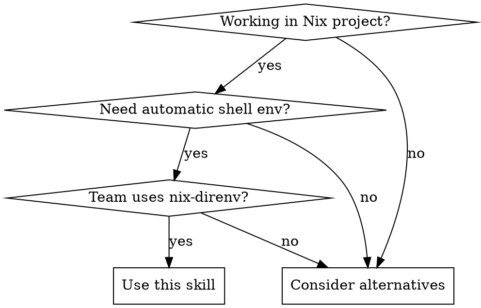

# Nix-Direnv Setup

## Overview
Standardized technique for setting up nix-direnv with automatic shell environment loading, proper git exclusions, and cross-project compatibility.

**This skill blocks common rationalizations** - follow exactly, especially under pressure.

## When to Use



**When NOT to use:**
- Project doesn't use flakes or shells (use `nix develop` directly)
- Team prefers manual environment management
- Simple projects where `nix shell` is sufficient

## Core Pattern

### Before (Common mistakes):
```bash
# Trial and error approach
echo "use nix" > .envrc
direnv allow  # Fails - no shell.nix
echo "use flake" > .envrc
direnv allow  # Fails - no devShell
echo "use flake .#devShell" > .envrc
direnv allow  # Wrong syntax
# ...10+ minutes wasted
```

### After (Standardized setup):
```bash
# One-time setup
echo "use flake" > .envrc
direnv allow

# Git exclusions handled automatically
# Project works immediately
```

## Quick Reference

| Task | Command | Content |
|------|---------|---------|
| **Basic .envrc** | `echo "use flake" > .envrc` | Automatic devShell loading |
| **Git exclusions** | Edit `.git/info/exclude` | Local developer files only |
| **NixOS templates** | `https://github.com/NixOS/templates` | Reference best practices |
| **direnv status** | `direnv status` | Check current state |
| **Clear cache** | `rm -rf .direnv/` | Force rebuild if corrupted |

## Implementation

### Step 1: Create .envrc
```bash
# Create minimal .envrc
echo "use flake" > .envrc

# Test before allowing
direnv status
```

**Commit .envrc to project** - team-wide configuration

### Step 2: Ensure devShell exists in flake.nix
```nix
# Reference: https://github.com/NixOS/templates
# Use templates as best practice guide

{
  outputs = { self, nixpkgs, ... }: {
    # Development shells for all platforms
    devShells = nixpkgs.lib.genAttrs [
      "aarch64-darwin" "x86_64-darwin"
      "x86_64-linux" "aarch64-linux"
    ] (system: let
      pkgs = nixpkgs.legacyPackages.${system};
    in {
      default = pkgs.mkShell {
        # Essential tools only
        packages = with pkgs; [ git jq nixfmt ];

        shellHook = ''
          echo "✨ Development environment ready"
        '';
      };
    });
  };
}
```

### Step 3: Git Exclusions (Local Only)
```bash
# .git/info/exclude - NEVER commit this
# Personal developer files, not project-wide

# Build artifacts
result-*
.direnv/

# Local files
.env.local
.*.swp
*~

# Cache
.cache/
.nix-build/

# Test outputs
test-scenarios/
*.log
```

**Use `.git/info/exclude`** (local) vs `.gitignore` (shared)

### Step 4: Enable and Test (NEVER SKIP)
```bash
# Enable direnv in this directory
direnv allow

# Test environment loading (MANDATORY verification)
direnv exec . bash -c "which git && echo '✅ Environment loaded'"

# Verify core functionality (REQUIRED)
direnv exec . nix flake show 2>/dev/null && echo "✅ Flake accessible" || echo "❌ Check flake.nix"
direnv exec . make --version >/dev/null 2>&1 && echo "✅ Build system accessible" || echo "❌ Check Makefile"
```

**No exceptions:** Verification is never optional. If tests fail, fix before proceeding.

## Common Mistakes & Rationalization Blockers

| Mistake | Rationalization Used | Reality |
|---------|-------------------|---------|
| **Forgetting devShell** | "The flake should work without it" | `use flake` requires `devShells.default` in flake.nix |
| **Wrong .git exclusions** | "This project is different" | `.git/info/exclude` is ALWAYS for personal files, never project-wide |
| **Skipping verification** | "Demo is in 5 minutes, I'll fix later" | Broken environments ALWAYS break at worst time |
| **Complex .envrc** | "This needs special flags" | `use flake` is sufficient 95% of time |
| **"I'll fix it later" promises** | "Just need it working for now" | Tech debt compounds exponentially |

## Red Flags - STOP and Start Over

- "I'll skip this step"
- "This project is different"
- "I'll fix it after the demo"
- "The warnings don't matter"
- "Good enough for now"

**All of these mean: You're about to create problems. Follow the skill exactly.**

## Cache Management

**Normal behavior:**
- `.direnv/` appears (100-200MB) - this is expected
- Contains symlinked profile to Nix store
- Persists across sessions for speed

**When to clean:**
```bash
# If environment seems corrupted
rm -rf .direnv/
direnv allow  # Rebuild
```

**Never commit `.direnv/`** - always exclude it.

## Advanced Patterns

### Multiple Development Shells
```bash
# .envrc (select specific shell)
use flake .#devShells.aarch64-darwin.backend
```

### Development Variations
```bash
# With extra flags (rarely needed)
use flake --impure

# Non-flake projects
use nix
```

**Reference NixOS templates for patterns:**
- `https://github.com/NixOS/templates/tree/main`
- Study `flake.nix` in template projects
- Adapt patterns to your project structure

## Real-World Impact

- **Setup time:** 10+ minutes → 2 minutes
- **Team consistency:** Everyone uses same approach
- **Zero configuration drift:** git-tracked .envrc
- **Cross-project compatible:** Works across all flake projects
- **Cache efficiency:** Proper management avoids unnecessary rebuilds
