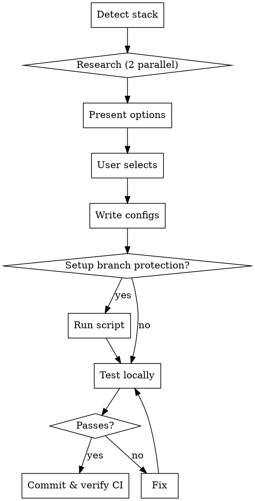

# Setting Up Pre-commit and CI

## The Iron Law

```
NO PRE-COMMIT WITHOUT CI
NO CHANGES WITHOUT TESTING
```

**Core principle**: Local and CI must be consistent. If it passes locally, it must pass in CI.

## Workflow



## Step-by-Step

### 1. Detect Tech Stack

```bash
# Check for dependency and config files
ls package.json requirements.txt pyproject.toml Cargo.toml go.mod \
   .eslintrc tsconfig.json 2>/dev/null

# Check existing setup
cat .pre-commit-config.yaml 2>/dev/null
ls .github/workflows/*.yml 2>/dev/null
```

If unclear, check source files (*.py, *.js, *.ts) or ASK USER.

### 2. MANDATORY Competitive Research

**REQUIRED for**: New setup, adding hooks, user requests

**SKIP for**: Version updates only, removing hooks

**Process**: Launch 2 parallel subagents with Task tool, identical prompts:

```
Research best practices for pre-commit in [TECH_STACK].
You are competing with another agent.

Include:
1. Recommended hooks for 2025
2. Versions (latest stable)
3. Config best practices
4. Common pitfalls

Sources: pre-commit.com, language docs, popular repos, recent guides

Provide specific .pre-commit-config.yaml recommendations.
```

**Present both** to user - let them choose or combine.

### 3. Write Configs

**Pre-commit**: See [templates/precommit-config-template.yml](templates/precommit-config-template.yml)

**CI**: Copy [templates/ci-workflow-template.yml](templates/ci-workflow-template.yml) to `.github/workflows/pre-commit.yml`

### 4. Branch Protection (Recommended)

Run: `scripts/setup-branch-protection.sh`

Sets up:
- Direct push to main blocked
- CI must pass to merge
- Force push disabled

Options: `--yes` (auto-confirm), `--branch <name>`

### 5. Test Locally

```bash
pip install pre-commit  # or brew install pre-commit
pre-commit install
pre-commit run --all-files
```

**MUST pass before committing**. Fix issues, re-run until clean.

### 6. Commit & Verify

```bash
git add .pre-commit-config.yaml .github/workflows/pre-commit.yml
git commit -m "Add pre-commit with CI"
git push
```

**Watch CI run**. If CI fails but local passed → investigate inconsistency.

## Modifying Existing Setup

1. Research (for new hooks)
2. Edit config
3. Verify CI has same hooks
4. Test: `pre-commit run --all-files`
5. Commit & verify CI

## Common Mistakes

| Mistake | Why Wrong | Fix |
|---------|-----------|-----|
| "Local only, CI later" | CI never added | CI is mandatory |
| "Quick, skip test" | Breaks everyone | Always test |
| "Local works, ship it" | Env differences | Verify in CI |
| "Use standard" | Undefined, outdated | Research |
| Skip research for "simple" add | Tools evolve | Quick research |

## Red Flags - STOP

- "Quick, skip testing" → Quick done right, not quick and broken
- "CI later" → CI mandatory, period
- "Just one hook" → One hook breaks everything
- "Local works" → Local ≠ CI
- "User wants fast" → Fast = efficient, not careless
- "Ask about research" → Launch research, don't ask
- "Skip research option" → User picks result, not whether to research

## Debugging: Local Passes, CI Fails

**Common causes**:
1. Different tool versions → Pin in both
2. Missing dependencies → CI needs same deps
3. File not committed → Check .gitignore
4. Environment variables → CI missing env vars

**Process**: Compare environments → Identify difference → Fix root cause → Test both

## Real Impact

**Without**:
- Devs use `--no-verify`
- CI catches what local missed
- "Works on my machine"

**With**:
- Local and CI always consistent
- Developers trust hooks
- Issues caught before commit
