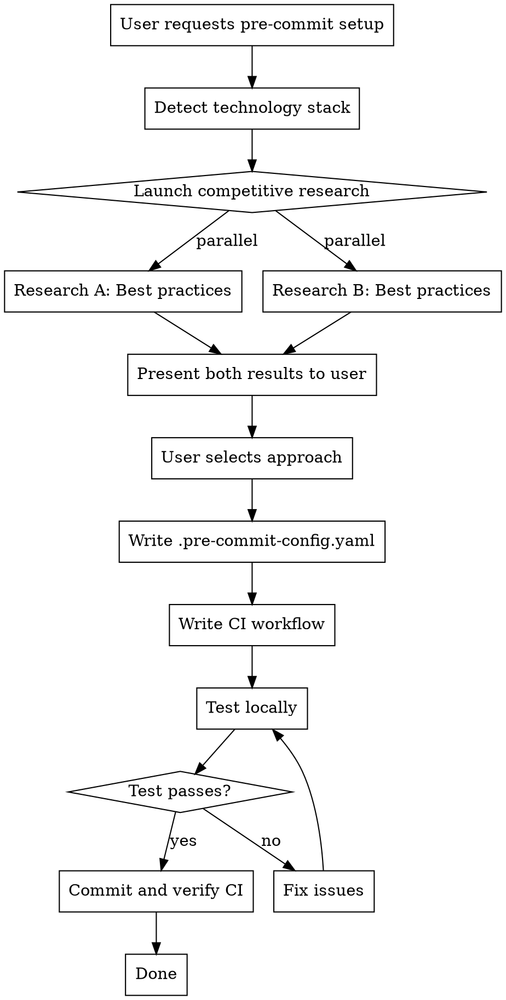
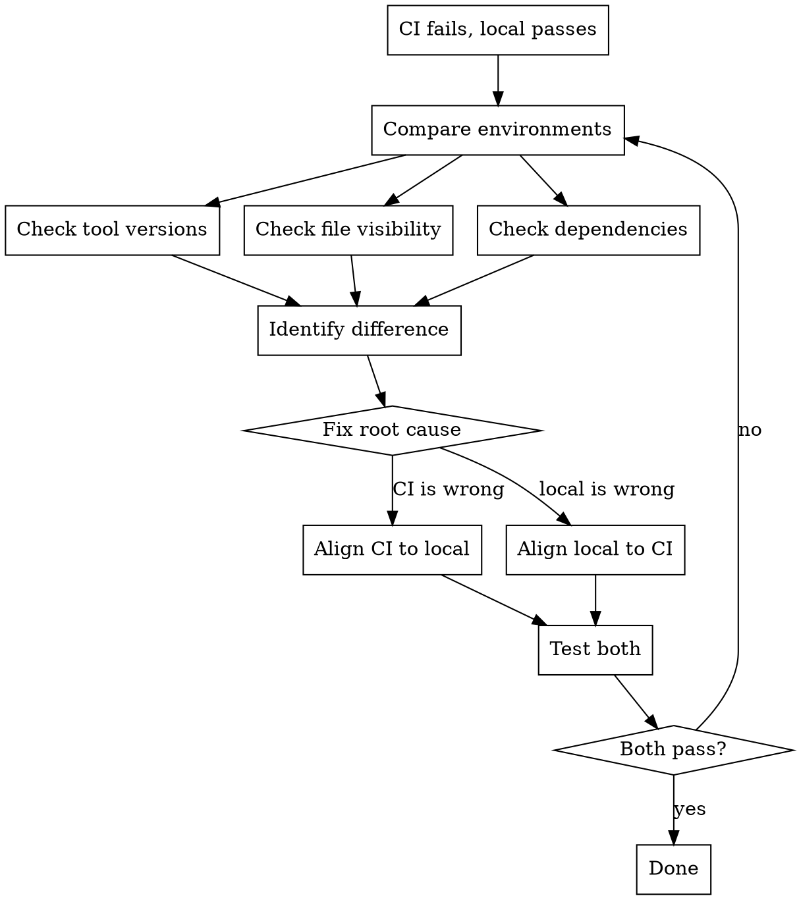

# Setting Up Pre-commit and CI

## Overview

**Pre-commit without CI is half a solution.** Local hooks catch issues before commit, CI ensures everyone runs the same checks.

**Core principle**: If it passes locally, it must pass in CI. If it fails in CI, it must fail locally.

## The Iron Law

```
NO PRE-COMMIT SETUP WITHOUT CI WORKFLOW
NO PRE-COMMIT CHANGES WITHOUT TESTING
```

## When to Use

Use this skill when:
- Setting up pre-commit for new project
- Adding/removing/modifying hooks in existing config
- Pre-commit passes locally but fails in CI
- Project has pre-commit but no CI workflow

Do NOT use for:
- Projects that explicitly cannot use CI
- Read-only analysis of existing setups

## Workflow



## Step-by-Step Process

### 1. Detect Technology Stack

**BEFORE researching, understand the project:**

```bash
# Check for dependency files
ls package.json requirements.txt pyproject.toml Cargo.toml go.mod 2>/dev/null

# Check existing pre-commit config
cat .pre-commit-config.yaml 2>/dev/null

# Check for CI workflows
ls .github/workflows/*.{yml,yaml} .gitlab-ci.yml 2>/dev/null
```

Extract:
- **Languages**: Python, JavaScript/TypeScript, Rust, Go, etc.
- **Tools**: ESLint, Black, Ruff, Prettier, mypy, etc.
- **Existing hooks**: What's already configured
- **Existing CI**: What CI platform (GitHub Actions, GitLab, etc.)

If unclear, ASK USER directly:
- "What languages/frameworks does this project use?"
- "Do you have preferences for linters/formatters?"

### 2. MANDATORY Competitive Research

**REQUIRED when**: Setting up pre-commit for the first time

**Optional when**: User explicitly requests research for existing setup

**IMPORTANT**: Do NOT ask user for permission to research. Launch research, THEN present results for user to choose.

**How**: Launch 2 parallel subagents with Task tool

**Subagent A prompt:**
```
Research best practices for pre-commit setup in [DETECTED_TECH_STACK].

You are competing with another agent to find better recommendations.

Include:
1. Current recommended hooks for 2025
2. Versions to use (latest stable vs pinned)
3. Configuration best practices
4. Common pitfalls to avoid

Sources to check:
- Official pre-commit.com documentation
- Language-specific linting/formatting tool docs
- Popular GitHub repositories using this stack
- Recent blog posts/guides (2024-2025)

Provide specific .pre-commit-config.yaml recommendations.
```

**Subagent B prompt:**
```
[IDENTICAL TO SUBAGENT A]
```

**Present both results** to user:
```
Two research approaches found:

**Approach A:**
[Summary of A's recommendations]
- Pros: [...]
- Cons: [...]

**Approach B:**
[Summary of B's recommendations]
- Pros: [...]
- Cons: [...]

Which approach do you prefer, or should I combine the best of both?
```

**IMPORTANT**: DO NOT pick for the user. Present options, let them decide.

### 3. Write .pre-commit-config.yaml

Based on research/user selection, create config with:

**Required structure:**
```yaml
repos:
  - repo: https://github.com/pre-commit/pre-commit-hooks
    rev: v4.6.0  # Use current latest
    hooks:
      - id: trailing-whitespace
      - id: end-of-file-fixer
      - id: check-yaml
      - id: check-added-large-files

  # Language-specific hooks based on tech stack
  # Example for Python:
  - repo: https://github.com/psf/black
    rev: 24.10.0
    hooks:
      - id: black

  - repo: https://github.com/astral-sh/ruff-pre-commit
    rev: v0.7.4
    hooks:
      - id: ruff
        args: [--fix]
      - id: ruff-format
```

**Version selection:**
- Use latest stable versions (verify with research)
- Pin to specific versions, not branches
- Document why if using older version

### 4. Write CI Workflow

**CI is MANDATORY, not optional.**

Create `.github/workflows/pre-commit.yml` (adjust for GitLab/other CI):

```yaml
name: pre-commit

on:
  pull_request:
  push:
    branches: [main, master]

jobs:
  pre-commit:
    runs-on: ubuntu-latest
    steps:
      - uses: actions/checkout@v4
      - uses: actions/setup-python@v5
        with:
          python-version: '3.12'

      # Install language-specific dependencies if needed
      # For Node.js projects:
      # - uses: actions/setup-node@v4
      #   with:
      #     node-version: '20'

      - uses: pre-commit/action@v3.0.1
```

**Critical**: CI must run the SAME hooks as local pre-commit.

### 5. Test Locally

**MANDATORY before claiming done:**

```bash
# Install pre-commit
pip install pre-commit  # or brew install pre-commit

# Install hooks
pre-commit install

# Run on all files
pre-commit run --all-files
```

**If tests fail:**
- Fix issues (code or config)
- Run again until passing
- NEVER skip failures

**If tests pass:**
- Proceed to commit

### 6. Commit and Verify CI

```bash
git add .pre-commit-config.yaml .github/workflows/pre-commit.yml
git commit -m "Add pre-commit with CI workflow"
git push
```

**THEN verify CI:**
- Check GitHub Actions (or relevant CI) runs
- Confirm it passes
- If CI fails but local passed: **STOP** - investigate inconsistency

## Modifying Existing Pre-commit

**When adding/changing hooks:**

1. **Research** (even for "simple" changes)
   - What's the current best practice?
   - Are there better alternatives now?

2. **Edit config**
   - Make minimal necessary changes

3. **Verify CI still has same hooks**
   - Check `.github/workflows/` or CI config
   - Update if needed

4. **Test locally**
   ```bash
   pre-commit run --all-files
   ```

5. **Commit and verify CI**
   - Push changes
   - Watch CI run
   - Confirm passes

## Common Mistakes

| Mistake | Why It's Wrong | Correct Approach |
|---------|---------------|------------------|
| "Just local pre-commit, CI later" | CI never gets added | CI is part of setup, not optional |
| "Quick change, no need to test" | Config errors break everyone | Always test, even 1-line changes |
| "Local passes, ship it" | CI might fail due to env differences | Always verify in CI after push |
| "Use whatever is standard" | "Standard" undefined, likely outdated | Research current best practices |
| Skip research for "simple" adds | Tools evolve, better options exist | Quick research prevents tech debt |
| Hard-code versions without checking | Might use outdated/vulnerable versions | Verify latest stable versions |

## Resisting Rationalization

**Red flags - STOP if you think:**
- "This is quick, skip testing"
- "CI can come later"
- "It's just one hook, won't break anything"
- "Local works, good enough"
- "User said quickly, skip research"
- "Let me ask if they want research" (for new setups)
- "User can choose to skip research"

**Reality:**
- Quick done right > Quick and broken
- CI is mandatory, period
- One hook can break entire workflow
- Local ≠ CI environment
- "Quickly" means efficient, not careless
- Research is mandatory for new setups, not optional
- User chooses WHICH research result, not WHETHER to research

## Debugging: Local Passes, CI Fails

**When this happens:**



**Common causes:**
1. **Different tool versions** - Pin versions in both places
2. **Missing dependencies** - CI needs same deps as local
3. **File not committed** - `.gitignore` hiding needed files
4. **Environment variables** - CI missing required env vars

## Real-World Impact

**Without this discipline:**
- ❌ Developers commit with `--no-verify` because hooks unreliable
- ❌ CI catches issues local hooks missed
- ❌ "Works on my machine" syndrome
- ❌ Pre-commit becomes waste of time

**With this discipline:**
- ✅ Local and CI always consistent
- ✅ Developers trust the hooks
- ✅ Issues caught before commit, not in CI
- ✅ Pre-commit saves time, not wastes it
